# G-Naira Digital Currency (gNGN)

## Background

There is a rising issue concerning the country’s financial sector. To solve this, the government decided to move its financial system to the Blockchain for better transparency and accountability.

The #G-Naira(gNGN) is an digital currency that uses the ERC-20 token standard.
The contract has a GOVERNOR who has the only right/access to:

- Mint new token currency
- Burn token currency
- Blacklist address/es to prevent them for sending and receiving tokens

The contract also has a Multi-Signature Wallet for secure Minting and Burning of Tokens

# Deployment

The contract was deployed on the [sepolia-Testnet](https://sepolia.etherscan.io/address/0x68073d37e4F50aF4346C3ADCDBa7A7a5F3a58B84#code) with a TotalSupply of 100000000 and Maximum Supply of 1000000000, using [Hardhat](https://hardhat.org/) and [Alchemy](https://www.alchemy.com/) as the node provider.

## EtherScan-Url

- https://sepolia.etherscan.io/address/0x68073d37e4F50aF4346C3ADCDBa7A7a5F3a58B84#code

## Contract Address

- 0x68073d37e4F50aF4346C3ADCDBa7A7a5F3a58B84

## TotalSupply

- 100000000

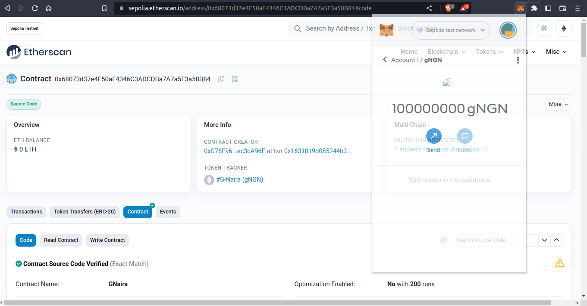

## Maximum Supply

- 1000000000

## Replit-Url

The Replit url contains just the code.

- https://replit.com/@MarcellusIfeany/G-Naira#Gnaira.sol

## Live Demo

- The G-Naira Decentralized Application is available online at:
- https://gnaira.vercel.app/

### Hint Before use:

Only the Governor has access to execute major functions or EVM calls.
For full interaction with the Dapp, I recommend you re-deploy the smart contract using your own Private Key and API and then copy the contract Address and ABI that is generated and replaced it with the contract Address and ABI inside the config.js file inside constants of the frontEnd.

## Explanation How it Works | Youtube

## Sample Outputs A: Remix IDE

The images below shows the various outputs and cases on the UI of [Remix-IDE](https://remix.ethereum.org/#lang=en&optimize=false&runs=200&evmVersion=null), when the contract is deployed and interacted with.

### Default values after deploying the contract.

- This shows the Token-Name, Token-Symbol, Governor, Maximum Supply and TotalSupply

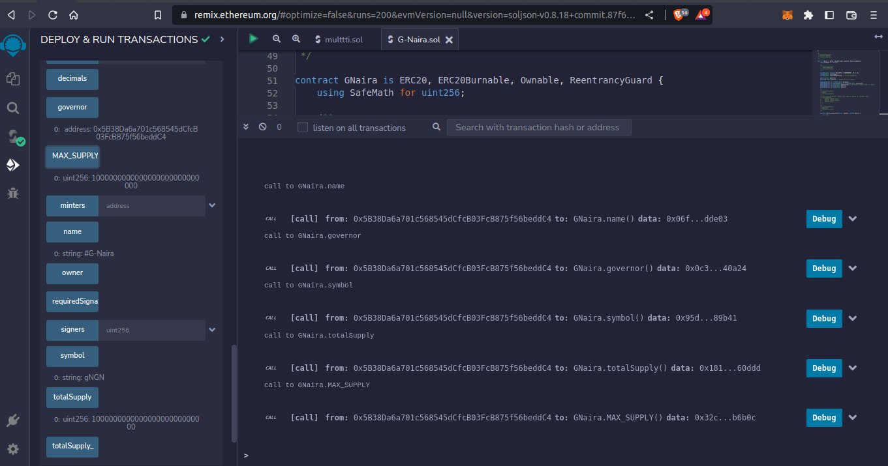

### Minting, Burning and Blacklisting by the Governor

- This shows the output when the "Governor account" is executing the functions. All functions will be successful, since only the Governor has the right/access to execute them.

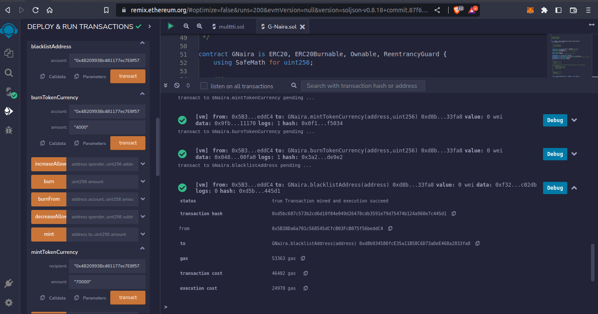

### Minting, Burning and Blacklisting by the Non-Governor

- This shows the output when the "non-Governor" is executing the functions. All functions will be reverted/unsuccessful.
  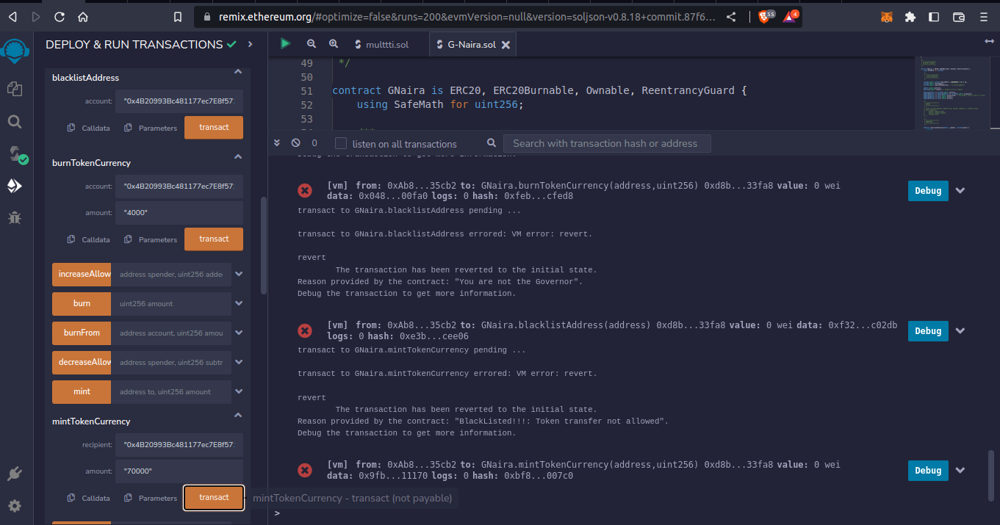

### Making Transfer to Blacklisted Address

- This shows the output of sending token currency to blacklisted account. The transaction will be reverted, since Blacklisted account cannot send or receive token currency

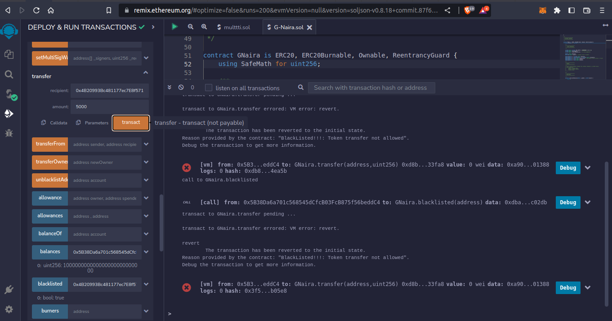

### Making Transfer to Non-Blacklisted Address

- This shows the output of sending token currency to non-blacklisted account. The transaction will not be reverted, since non-Blacklisted account is allowed by the Governor send or receive token currency

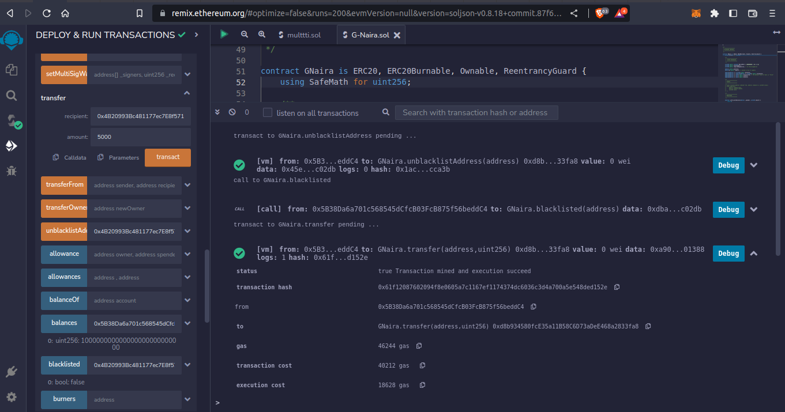

### MultiSigMint and MultiSigBurn by verified/approved Signers

- This shows the output of Setting up Multi signature wallet and Minting and Burning using the MultiSig wallet. The transaction will be successful, if it is done and signed by the signatory to the contract account, knowns as the "Signers"

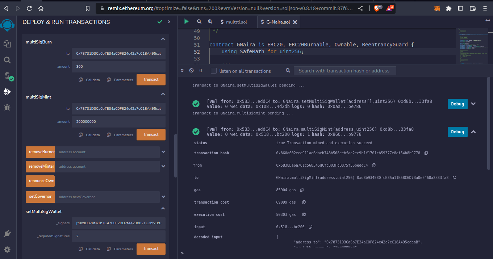

### MultiSigMint and MultiSigBurn by Non-verified/non-approved Signers

- This shows the output of Setting up Multi signature wallet and Minting and Burning using the MultiSig wallet. The transaction will be reverted.
  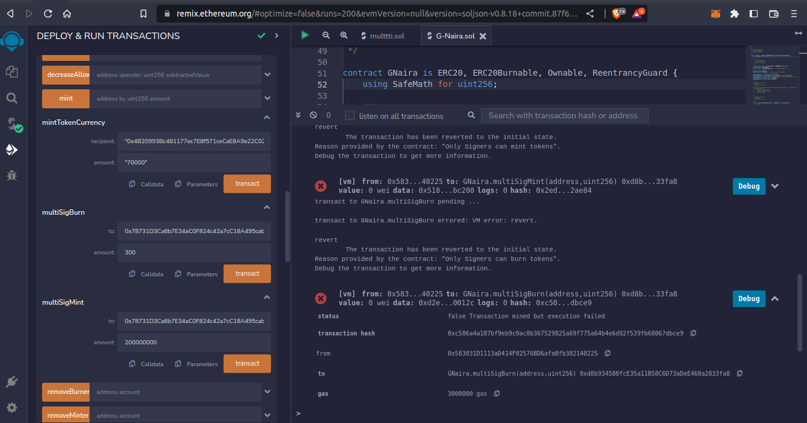

## Sample Outputs B: React Front-End

### HomePage

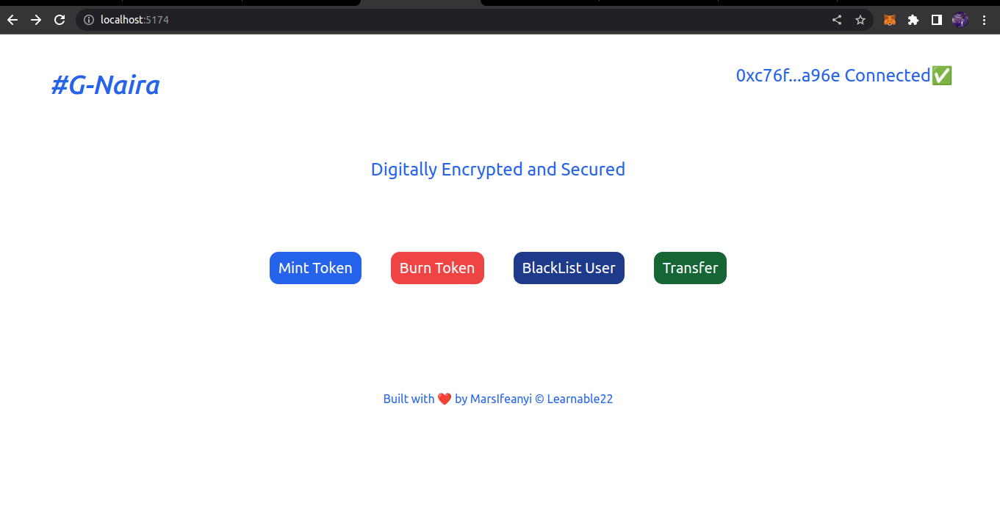

### Mint Token Page: Mining

This is the Mint token Currency Page, when I sent transaction and is still Mining (Sent to the Blockchain for confirmation by miners)
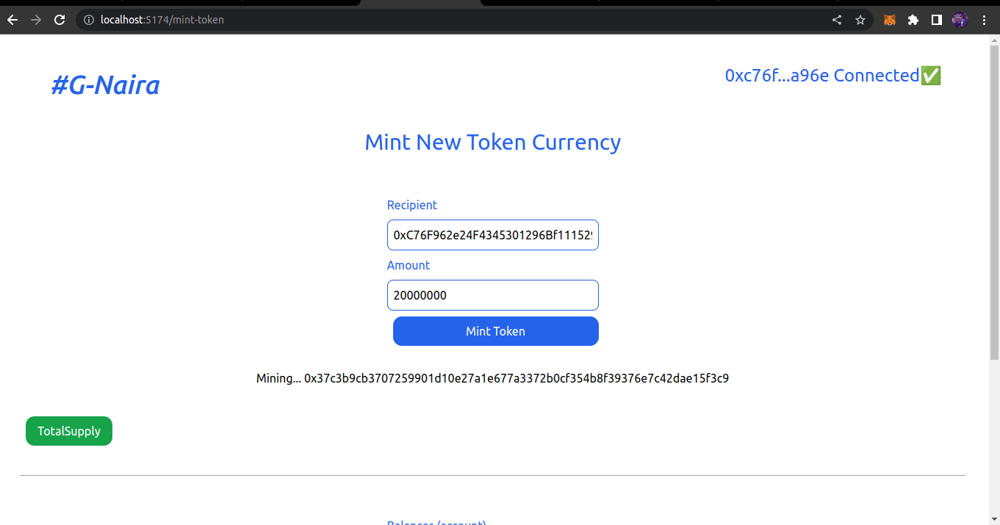

### Mint Token Page: Mined

This is the Mint token Currency Page, when the transaction has been Mined (Block confirmations by miners)

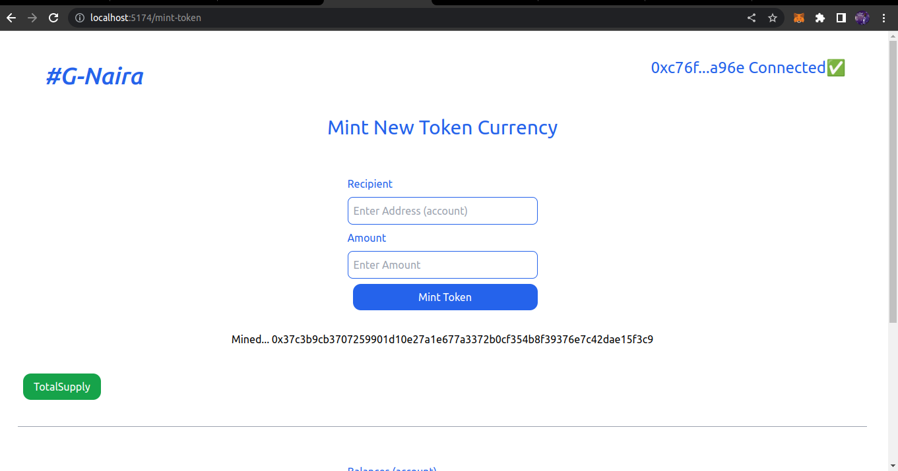

### Burn Token Page: Mining

This is the Burn Token Page, when I sent transaction and is still Mining
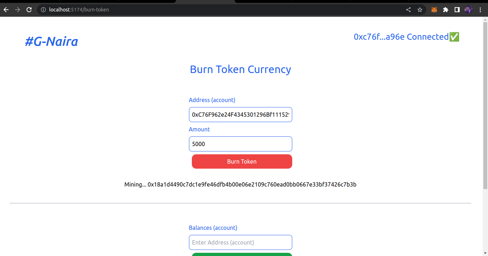

### Burn Token Page: Mined

This is the Burn Token Page, when the transaction has been mined
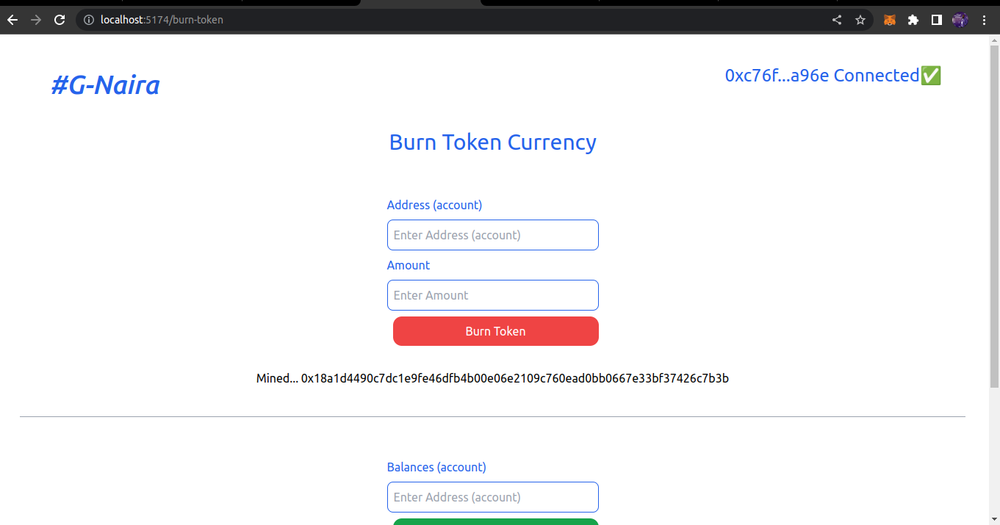

### Blacklist Address Page: Mining

This is the Blacklist Address Page when I sent transaction and is still Mining

### Blacklist Address Page: Mined

This is the Blacklist Address Page, when the transaction has been mined.
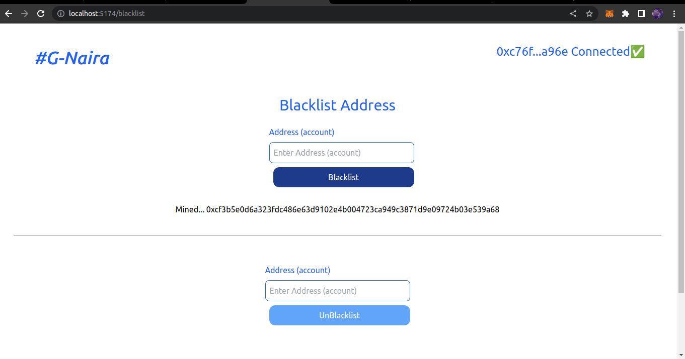

### UnBlacklist Address Page: Mining

This is the Blacklist Address Page when I sent transaction and is still Mining
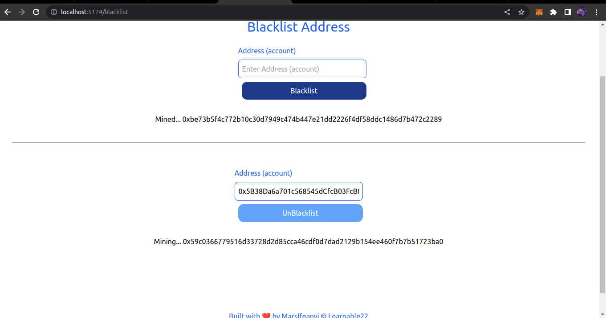

### UnBlacklist Address Page: Mined

This is the Blacklist Address Page, when the transaction has been mined.
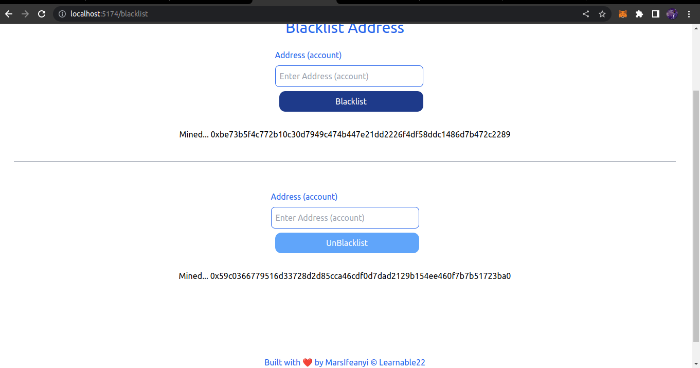

### Transfer Page: Mining

This is the transfer token currency page, when I sent transaction and is still mining
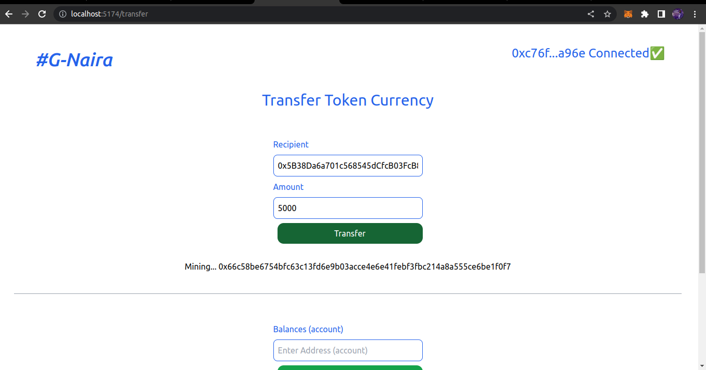

### Transfer Page: Mined

This is the transfer token currency page, when the transaction has been mined.
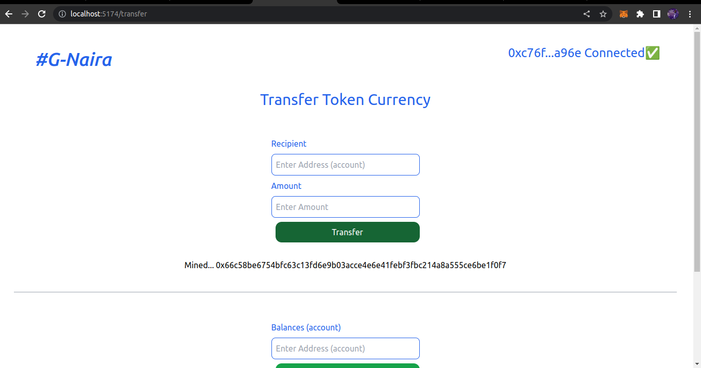

### Transaction Log on EtherScan

This is the transaction log on etherscan for all the interactions i did so far on the G-Naira contract.

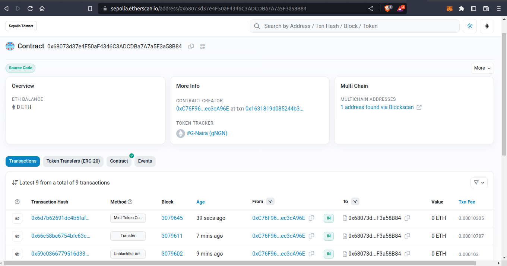

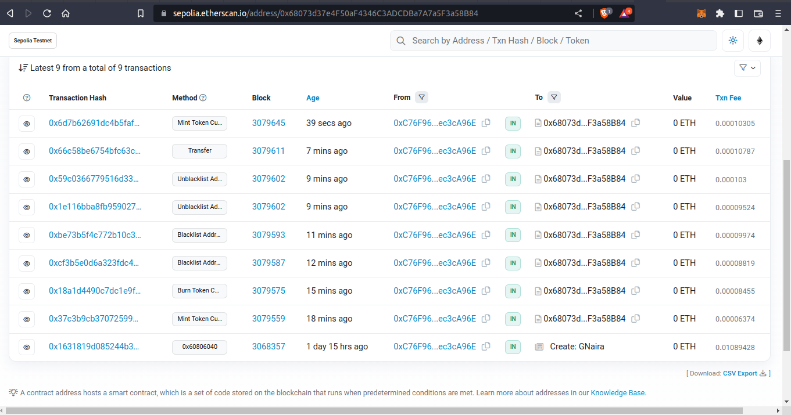

## Future Improvement

This project is subject to further improvements and addition of new features and upgrades.

- Functions: More of the smart contract functions will be integrated to the FrontEnd
- Security: More security features will be added to the Smart contract

- UI features. more features will be added for the UI

- Custom message: more custom message will be added to show the successful or error during transaction on the UI

- And more

## Contributing

This Project is Open for Contribution by all,
Pull requests are welcome.
For major changes, please open an issue first
to discuss what you would like to change.

### Instructions

- Fork this repository
- Clone your forked repository
- Add your scripts
- Commit and push
- Create a pull request
- Wait for pull request to merge

## Show your support

Give a ⭐️ if this project helped you!

## License

[MIT](https://choosealicense.com/licenses/mit/)
